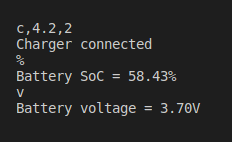
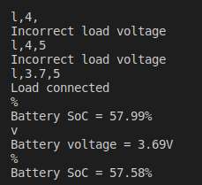
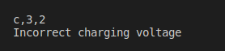
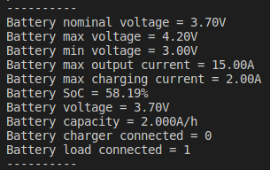

# Проект "Менеджер батареи"
## Оглавление
1. [Описание](#Описание)
2. [Структура менеджера батареи](#Структура-менеджера-батареи)
3. [Функции менеджера батареи](#Функции-менеджера-батареи)
4. [Результаты работы](#Результаты-работы)
____
## Описание
Менеджер батареи позволяет контролировать состояние роботы батареи, выполнять безопасную зарядку и разрядку. Имеется защита от переразряда батареи.

Работа менеджера происходит бесконечном цикле.
При помощи консоли имитируются различные действия с батареей, например подключение зарядного устройства. Также через консоль можно получать информацию о состоянии батареи и различных ее параметрах.
____
## Структура менеджера батареи
Структура менеджера батареи состоит из таких полей
```C
typedef struct 
{
    double capacity;
    double nominalVoltage;
    double minVoltage;
    double maxVoltage;
    double currentVoltage;
    double maxOutputCurrent;

    double chargingVoltage;
    double maxChargingCurrent;

    uint8_t isChargerConnected;
    uint8_t isLoadConnected;
} BatteryManager;
```
*capacity* - номинальная емкость батареи

*nominalVoltage* - номинальное напряжение батареи

*minVoltage* - минимальное допустимое напряжение батареи

*maxVoltage* - максимально допустимое напряжение батареи

*currentVoltage* - текущее напрежение батареи

*maxOutputCurrent* - максимальный выходной ток батареи

*chargingVoltage* - номинальное напряжение зарядки

*maxChargingCurrent* - максимальный ток зарядки

*isChargerConnected* - флаг подключения зарядноко устройства

*isLoadConnected* - флаг подключения нагрузки
___
## Функции менеджера батареи
```C
double getBatteryVoltage(BatteryManager* batteryManager);
double getBatteryCapacity(BatteryManager* batteryManager);
double getStateOfCharge(BatteryManager* batteryManager);

uint8_t connectCharger(BatteryManager* batteryManager, double voltage, double current);
void disconnectCharger(BatteryManager* batteryManager);
uint8_t chargeBattery(BatteryManager* batteryManager, double voltage, double current);

uint8_t connectLoad(BatteryManager* batteryManager, double voltage, double current);
void disconnectLoad(BatteryManager* batteryManager);
uint8_t unchargeBattery(BatteryManager* batteryManager, double voltage, double current);
```
*getBatteryVoltage()* - получение текущего напряжения батареи

*getBatteryCapacity()* - получение номинальной емкости батареи

*getStateOfCharge()* - получение уровня заряда батареи в процентах

*connectCharger()* - подключение зарядного устройства

*disconnectCharger()* - отключение зарядного устройства

*chargeBattery()* - зарядка батареи

*connectLoad()* - подключение нагрузки к батарее

*disconnectLoad()* - отключение нагрузки к батарее

*unchargeBattery()* - разрядка батареи
___
## Результаты работы
### Подключение зарядного устройства


### Подключение нагрузки


### Некорректное напряжение зарядки


### Вывод всей информации о батарее


____
